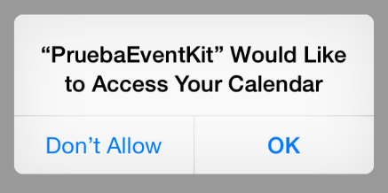

## Serialización de clases arbitrarias

Lo que Apple denomina *archiving* o *coding* es lo que en otros lenguajes normalmente se conoce como **serialización** o *marshalling*, es decir, transformar un objeto de cualquier clase o un grafo de objetos en una secuencia de bytes que se pueda almacenar en un archivo.

### El protocolo NSCoding

Para que un objeto sea serializable (o “archivable”) debe implementar el protocolo `NSCoding`. Dicho protocolo exige que se implementen dos métodos: `encodeWithCoder`, que se debe encargar de serializar el objeto, y `initWithCoder`, que debe realizar la operación contraria, la deserialización. 

Como ejemplo, supongamos que tenemos una clase `Alumno` que representa un alumno de un determinado curso o asignatura. Su interfaz podría ser algo como:

	#import <Foundation/Foundation.h>
	
	@interface Alumno : NSObject 
	@property NSString *nombre;
	@property BOOL varon;
	@property NSDate *fechaNacimiento;
	@end

Si queremos hacer que esta clase sea *serializable* debemos hacer que implemente el protocolo `NSCoding`. Lo primero sería declararlo en la interfaz:

	@interface Alumno : NSObject <NSCoding>

Ahora en el `.m` tendremos que implementar los métodos de serialización/deserialización. Vamos con la primera: para serializar el objeto simplemente tenemos que ir uno por uno serializando sus campos. Para serializar un determinado campo contamos con diversos métodos de la clase `NSCoder`, de los que elegiremos el apropiado al tipo de datos. Por ejemplo podemos serializar un valor booleano con ``encodeBool:forKey```, un entero con `encodeInt:forKey` o un objeto con `encodeObject:forKey`. 

Nótese el `forKey` del método de serialización. A cada campo que queremos serializar debemos asociarle un nombre simbólico (una *clave*) que debe ser un `NSString`. Esto nos permite serializar/deserializar los campos en el orden que queramos, simplemente especificamos en cada caso la clave adecuada.

No todos los objetos son automáticamente serializables por `NSCoder`. Por ejemplo sí lo son `NSString`, `NSDate` (puedes consultar la documentación estándar y ver que ambas clases son conformes a `NSCoding`). También son “automáticamente serializables” las colecciones (`NSArray`, `NSSSet` y `NSDictionary`) de esos tipos.

Teniendo en cuenta todo lo comentado, el código del método de serialización podría ser algo del estilo:

	//Definimos unas cuantas ctes. para que el código quede más limpio
	NSString * const KEY_NOMBRE = @"nombre";
	NSString * const KEY_FECHA_NACIMIENTO = @"fechaNacimiento";
	NSString * const KEY_VARON = @"varon";
	
	//Serialización
	- (void)encodeWithCoder:(NSCoder *)coder {
		 [coder encodeObject:self.nombre forKey:KEY_NOMBRE];
		 [coder encodeObject:self.fechaNacimiento forKey:KEY_FECHA_NACIMIENTO];
		 [coder encodeBool:self.varon forKey:KEY_VARON];
	}
 
Como se ve, el método que se encarga de la serialización recibe como parámetro el `NSCoder`. El código se limita a serializar uno a uno los campos, como ya se ha dicho, usando el `encodeXXX:forKey` apropiado al tipo de campo.

> No siempre es necesario serializar todos los campos. Si alguno de ellos se pudiera reconstruir a partir de los otros o de otra información no sería necesario serializarlo para poder “reconstituir” luego el objeto.

El método de deserialización será un método con la estructura típica de os inicializadores de Obj-C, que inicializa el objeto a partir de un `NSCoder`:

	- (instancetype)initWithCoder:(NSCoder *)coder {
	    self = [super init];
	    if (self) {
	        self.nombre = [coder decodeObjectForKey:KEY_NOMBRE];
	        self.fechaNacimiento = [coder decodeObjectForKey:KEY_FECHA_NACIMIENTO];
	        self.varon = [coder decodeBoolForKey:KEY_VARON];
	    }
	    return self;
	}
	

Como vemos nos limitamos a deserializar todos los campos. Nótese que el orden es indiferente y no tiene por qué ser igual que el de la serialización ya que cada campo tiene su clave.

Una cuestión interesante es que **el proceso de *archivado* o *serialización* es recursivo**. Es decir, archivar un objeto implica archivar cada uno de los campos, y estas operaciones pueden no ser “atómicas” si los campos son objetos. Por ejemplo supongamos que tenemos una clase `Grupo` que representa un grupo de objetos `Alumno` que forman parte de un curso:

	#import <Foundation/Foundation.h>
	
	@interface Grupo : NSObject <NSCoding>
	@property NSString *nombre;
	@property NSMutableArray *miembros;
	@end
	

Archivar un grupo es tan directo en términos de código Obj-C como archivar un único alumno

	NSString * const KEY_NOMGRUPO = @"nombre";
	NSString * const KEY_MIEMBROS = @"miembros";
	
	- (void)encodeWithCoder:(NSCoder *)coder {
	    [coder encodeObject:self.nombre forKey:KEY_NOMGRUPO];
	    [coder encodeObject:self.miembros forKey:KEY_MIEMBROS];
	}

Pero nótese que implica recursivamente archivar cada uno de los alumnos que lo componen. Al ejecutar el `encodeObject:forKey` sobre el array, `NSCoder` va a llamar automáticamente al proceso de archivo para cada componente del array, proceso que ya habíamos implementado al ser `Alumno` conforme a `NSCoding`.

### Archivar y “desarchivar” objetos

Para “disparar” el proceso de archivado tenemos la clase de “utilidad” `NSKeyedArchiver`. Podemos crear un `NSData` con los datos archivados, o bien guardarlos directamente en un fichero

	Grupo *grupo1 = ...
	...
	//Crear un NSData con el objeto serializado
	NSData *data = [NSKeyedArchiver archivedDataWithRootObject:grupo1];
	//otra opción, archivar en un fichero
	[NSKeyedArchiver archiveRootObject:grupo1 toFile:filePath];

Para el paso contrario, de “reconstituir” un grafo de objetos a partir de un archivo, usamos `NSKeyedUnarchiver`, que tiene métodos equivalentes a la anterior

	Grupo grupo1 = [NSKeyedUnarchiver unarchiveObjectWithFile:filePath];

## Calendarios

Como cualquier otro sistema operativo para móviles, iOS tiene integrado un calendario para que el usuario pueda gestionar sus citas y eventos. Como desarrolladores, el sistema nos ofrece un API para poder gestionar los calendarios desde nuestras aplicaciones. El *framework* que se usa para interactuar con calendarios, eventos y recordatorios se llama `Event Kit`.

> A partir de ahora cuando hablemos de “evento” nos estamos refiriendo a una cita del calendario y no a un evento en el sentido habitual en programación, salvo que especifiquemos lo contrario

### Eventos y permisos

La clase básica de Event Kit es `EKEventStore` y representa el conjunto de calendarios y eventos del usuario. Con esta clase es con la que debemos interactuar si queremos obtener los calendarios disponibles, crear un evento, eliminarlo,…

Solo hay un “Event Store” en el dispositivo, y podemos obtenerlo simplemente con:

	EKEventStore *store = [[EKEventStore alloc] init];

> No se recomienda hacer el `init` cada vez que queramos acceder al Event Store ya que es un proceso relativamente costoso, es mejor guardarlo en alguna variable u objeto al que tengamos acceso desde todo nuestro código de gestión de eventos

Antes de intentar ejecutar cualquier operación con los calendarios, lo primero que deberíamos hacer es pedir permiso al usuario. Podemos usar el método `requestAccessToEntityType:completion:`, que es *asíncrono* y admite un bloque de código en el parámetro `completion`, que se ejecutará cuando el usuario haya aceptado o denegado el permiso a la aplicación.

	[store requestAccessToEntityType:EKEntityTypeEvent 
	       completion:^(BOOL granted, NSError *error) {
	        if (granted) 
	            NSLog(@"Gracias, amable usuario");
	}];

El primer parámetro del método es el tipo de evento al que queremos acceder. Pueden ser eventos propiamente dichos (constante `EKEntityTypeEvent` o dicho de otro modo, “citas”) o recordatorios (constante `EKEntityTypeReminder`)

> En iOS, al contrario que en Android, la aplicación no necesita permiso para acceder a los calendarios cuando se instala, sino en el momento que quiere acceder a ellos. Esto ocurre con muchos otros APIs como el de acceso a las fotos, a la cámara, a la geolocalización, …

Si es la primera vez que nuestra aplicación intenta acceder a los eventos, el usuario verá el típico mensaje solicitando el permiso



El sistema iOS recuerda los permisos dados por el usuario, de modo que si los concede la primera vez, la siguiente vez que ejecutemos la aplicación ya no se los pedirá al usuario, simplemente nos devolverá el parámetro `granted` a `YES` indicando que tenemos el permiso.

> Si estamos probando la aplicación es útil poder cambiar los permisos dados por el usuario. Podemos hacerlo en la aplicación de “Configuración” dentro del apartado “Privacidad”. En el subapartado “Calendarios” aparecen todas las aplicaciones que han solicitado acceso al calendario. También aparece al final  del apartado “privacidad” una lista de aplicaciones con los permisos que han solicitado (o sea que podemos ver para cada elemento las aplicaciones que han solicitado permiso y para cada aplicación los elementos a los que ha solicitado permiso). No obstante aquí solo podemos editar el permiso, pero no “resetearlo” para que nos lo vuelva a pedir. Para esto último, ir al apartado “General \> Reset” y elegir “Restablecer localización y privacidad”.


> Si mientras estamos ejecutando la aplicación en el simulador cambiamos el *status* de los permisos a través de la aplicación de “Settings” veremos que la aplicación aborta. Este es un comportamiento ya conocido del simulador.

Como alternativa a pedir siempre los permisos para ver si los tenemos o no, podemos consultar el estado actual con `authorizationStatusForEntityType:`, al que hay que pasarle una cte. indicando el tipo de elemento al que queremos acceder (evento o recordatorio) y nos devolverá un valor numérico indicando si tenemos o no permiso. 

### Acceder a los calendarios del usuario

Podemos enumerar los calendarios con el método `calendarsForEntityType:` del `EKEventStore`

	NSArray *cals = [store calendarsForEntityType:EKEntityTypeEvent];
	for (EKCalendar *cal in cals) {
	    NSLog(@"%@", cal.calendarIdentifier);
	}

Cada calendario es un objeto de la clase `EKCalendar`, con una serie de propiedades como su identificador (`calendarIdentifier`, una cadena alfanumérica única para cada calendario, su `title`, que es el título descriptivo con que se le muestra al usuario - pero puede no ser único, etc).

En cada dispositivo hay un calendario por defecto, que es al que se añaden los eventos que crea el usuario salvo que especifique lo contrario. Podemos obtener este calendario por defecto con `defaultCalendarForNewEvents`:

	EKCalendar *defaultCal = [store defaultCalendarForNewEvents];

### Crear eventos 

Los eventos de calendario se representan con instancias de la clase `EKEvent`. Para crear un evento:

1. Instanciamos un nuevo objeto `EKEvent`
2. Rellenamos sus propiedades: título, calendario al que pertenece, si se repite o no periódicamente, fecha de comienzo y finalización, etc.
3. Lo almacenamos ayudándonos del método `saveEvent:span:commit:error:` de la clase `EKEventStore`

Vamos a ver un ejemplo de código:

	//Obtenemos el "event store". Esto mejor hacerlo solo una vez, por eficiencia
	EKEventStore *store = [[EKEventStore alloc] init];
	...
	//Creamos un nuevo EKEvent vacío por el momento
	EKEvent *evento = [EKEvent eventWithEventStore:store];
	//metemos el evento en el calendario por defecto
	EKCalendar *defaultCal = [store defaultCalendarForNewEvents];
	evento.calendar = defaultCal;
	//Rellenamos el resto de propiedades del evento
	evento.title = @"Cumpleaños de Chiquito de la Calzada";
	//La fecha es el 28/5/2015
	NSDateComponents *comps = [[NSDateComponents alloc] init];
	comps.month = 5;
	comps.day = 28;
	comps.year = 2015;
	comps.hour = 0;
	comps.minute = 0;
	NSCalendar *cal_usu = [NSCalendar currentCalendar];
	NSDate *fecha = [cal_usu dateFromComponents:comps];
	evento.startDate = fecha;
	evento.endDate = fecha;
	//Al ser un cumpleaños, el evento es del tipo "todo el día"
	evento.allDay = YES;
	//Almacenamos el evento
	if ([store saveEvent:evento span:EKSpanThisEvent commit:YES error:&error]) {
	   NSLog(@"Evento guardado correctamente");
	}

En el `saveEvent`,  `span` se usa en el caso de eventos que se repiten (indica si solo queremos guardar este evento o todas las instancias futuras), y `commit` indica si queremos almacenarlo ya o lo vamos a hacer en modo “batch” (podemos crear varios eventos y luego guardarlos todos llamando al método `commit` del Event Store, lo que es más eficiente que almacenarlos uno por uno).

#### Eventos recurrentes

Un cumpleaños es un evento que se va a repetir cada año, por lo que podríamos configurarlo como evento recurrente. En el API las repeticiones de eventos se configuran con “reglas de recurrencia” o `EKRecurrenceRule`. Como ejemplo sencillo, veamos cómo especificaríamos que el evento debe repetirse cada año, en principio sin fecha de finalización:

	EKRecurrenceRule *recurrencia = [[EKRecurrenceRule alloc]
	         initRecurrenceWithFrequency:EKRecurrenceFrequencyYearly 
	         interval:1 end:nil];
	[evento addRecurrenceRule:recurrencia];

### Buscar eventos en un calendario

Podemos buscar eventos en un rango de fechas

	//Buscar eventos de hoy en adelante en el calendario por defecto
	//usamos el "truco" del método de clase "distantFuture" que nos da una fecha
	//dentro de varios cientos de años
	NSPredicate *pred = [store predicateForEventsWithStartDate:[NSDate date] 
	                     endDate:[NSDate distantFuture] calendars:@[defaultCal]];
	NSArray *eventos = [store eventsMatchingPredicate:pred];
	for (EKEvent *e in eventos) {
	     NSLog(@"%@", e.description);
	}

### Alarmas

Podemos asociar alarmas a los eventos. Las alarmas se representan con instancias de la clase `EKAlarm`

	EKEvent *evento = [EKEvent eventWithEventStore:store];
	evento.calendar = defaultCal;
	evento.title = @"Prueba";
	//Un evento que comienza mañana y dura 1 hora 
	//Los intervalos se dan en segundos, así que 1 día = 24*60*60
	evento.startDate = [NSDate dateWithTimeIntervalSinceNow:24*60*60];
	evento.endDate = [evento.startDate dateByAddingTimeInterval:60*60];
	//alarma 15 minutos antes del evento (cantidad negativa) 
	EKAlarm *alarma = [EKAlarm alarmWithRelativeOffset:-15*60];
	//Un evento tiene un NSArray con todas las alarmas, no una sola
	evento.alarms = @[alarma];
	NSError *error;
	[store saveEvent:evento span:EKSpanThisEvent commit:YES error:&error];
	if (!error) {
	  NSLog(@"Evento con alarma guardado OK");
	}