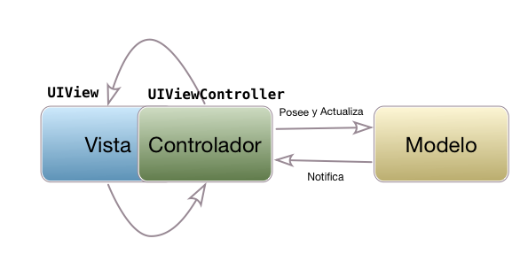

#Persistencia en dispositivos móviles
##iOS, sesiones 10 y 11: 
##Arquitecturas de aplicaciones en iOS


---

## Puntos a tratar

- Los problemas de MVC
- MVP (Model/View/Presenter)
- MVVM (Model/View/ViewModel)
- VIPER

---

## Puntos a tratar

- **Los problemas de MVC**
- MVP (Model/View/Presenter)
- MVVM (Model/View/ViewModel)
- VIPER

---

## MVC en la teoría


---

## MVC en la realidad



---

## El *controller* se encarga de...

- Recibir eventos del usuario y actualizar la interfaz
<!-- .element: class="fragment" --> 
- Ser el datasource y el delegate de las tablas 
<!-- .element: class="fragment" -->
- Ser el delegate de otros componentes como las search bar 
<!-- .element: class="fragment" -->
- Implementar llamadas a APIs, validación de datos, lógica de negocio...
<!-- .element: class="fragment" -->

---


---

**Sentido común** de desarrollador: cuando necesitemos hacer algo distinto de responder a un evento/modificar un *outlet* debemos implementarlo en **clases adicionales**

<!-- .element class="fragment" --> Pero...no estaría de más tener alguna pista más concreta de dónde poner las cosas, y cómo conectarlo con el resto de componentes...veamos **arquitecturas alternativas** más detalladas 

---

## Puntos a tratar

- Los problemas de MVC
- **MVP (Model/View/Presenter)**
- MVVM (Model/View/ViewModel)
- VIPER

---


- El *presentador* se encarga de la *lógica de presentación*, es decir convertir/modificar/formatear datos (p. ej. fechas, distancias, ...) en el formato adecuado para la vista
- Es independiente de la tecnología de la vista


---

## ¿Qué es la vista en MVP?

- Lo mismo que era en MVC, pero...
- Aunque pueda parecer un poco raro, un "view controller" de iOS también se considera vista

---

 <!-- .slide: data-background-image="http://www.thebrokeagent.com/sitemain/wp-content/uploads/2016/12/are-you-serious-wtf-meme-baby-face.jpg" -->

---

- Al estar el ciclo de vida del "view controller" y de los elementos de interfaz tan unidos, es mejor considerarlos a todos como vista

- Además conseguimos que la vista sea el único componente directamente dependiente de la tecnología de presentación, en iOS `UIKit`


---

## Ejemplo sencillo: UAdivino con MVP


---


Repo ejemplo en Github: [https://github.com/ottocol/ejemplos-arquitectura-iOS/tree/master/MVP](https://github.com/ottocol/ejemplos-arquitectura-iOS/tree/master/MVP)

---

## El *presenter*

1. Es llamado por la vista: `solicitarRespuesta()`
2. Llama al modelo con `obtenerRespuesta()` y obtiene el resultado como un objeto `Respuesta`.
3. Lógica de presentación: si el campo `ok` del objeto respuesta es `true` devuelve color verde, en caso contrario rojo

```swift
enum ColorRespuesta {
  case verde
  case rojo
}
```


---

## El *presenter* debe ser independiente de `UIKit`

- Lo más sencillo para representar un color en iOS es usar `UIColor`, pero el *presenter* no debe tener esta dependencia
- La vista es la que se encarga de traducir este enumerado a `UIColor`
- Al no depender de `UIKit` es más fácil hacer *testing* de esta clase al estilo "tradicional"


---

## Puntos a tratar

- Los problemas de MVC
- MVP (Model/View/Presenter)
- **MVVM (Model/View/ViewModel)**
- VIPER

---

## MVVM (Model/View/ViewModel)


- El *viewmodel* hace lo mismo que el *presenter*
- Diferencia: tenemos ***bindings* automáticos entre las propiedades del *viewmodel* y las de la vista**. Cuando cambia un "lado", el otro lo hace también automáticamente

---

## *Bindings*

- Necesitamos alguna librería/*framework* que implemente estos *bindings*, ya que en iOS no existen de forma nativa
- Aquí usaremos una librería llamada [Bond](https://github.com/ReactiveKit/Bond), (Swift Bond, :) ). Hay otras alternativas: ReactiveCocoa, RxSwift, ...

---

## *Data binding* en Bond

- Se pueden vincular *observables*. Es un concepto tomado de la *programación funcional reactiva* (también llamados *streams*, *signals*,...)
- Los observables son similares a los eventos. Uno o más observadores (similares a *listeners*), reciben los cambios en el valor del observable
- La parte de programación funcional es la que nos permite transformar/manipular/combinar los observables

---

## Observables en Bond

- En el *ViewModel* podemos crear un observable del tipo necesario

```swift
var obs = Observable<String>("")
```

- `obs` no es un `String`, sino un observable. El `String` está en `obs.value`

```swift
obs.value = "un nuevo valor"
```

---

## *Binding* del observable

- Lo más típico es vincular el observable con una propiedad de un control de `UIKit`. Bond extiende los controles con una propiedad `reactive`, y dentro de ella los campos habituales del control (`text`, `color`,...) pero en versión *observable*

```swift
//suponemos un outlet en la vista que representa un "label": labelOutlet
viewModel.obs.bind(to:self.labelOutlet.reactive.text)
```

---

## UAdivino versión MVVM 

- Repo Github: [https://github.com/ottocol/ejemplos-arquitectura-iOS/tree/master/MVVM/UAdivino](https://github.com/ottocol/ejemplos-arquitectura-iOS/tree/master/MVVM/UAdivino)

---

## Ensamblando Vista/ViewModel/Modelo

- Recordar que el *view controller* es parte de la vista. En él definimos

```swift
class UAdivinoView : UIViewController { 
  let viewModel = UAdivinoViewModel()
  ...
}
```


- En el view model


```swift
class UAdivinoViewModel {
  let model = UAdivinoModel()
  ...
}
```

---

# ¿Alguna pregunta?