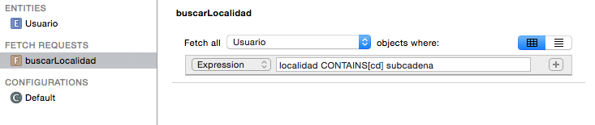

#Persistencia en dispositivos móviles
##iOS, sesión 7: Búsquedas en Core Data


---

## Puntos a tratar

- **Predicados y *fetch requests***
- Predicados como cadenas
- *Fetch request templates*
- Predicados como objetos
- Ordenación

---

## Fetch requests

```objectivec
NSFetchRequest *request = [NSFetchRequest fetchRequestWithEntityName:@"Usuario"];
//Necesitamos el contexto de persistencia!!!
ManagedObjectContext *miContexto = ...
NSError *error;
NSArray *results = [miContexto executeFetchRequest:request
                   error:&error];
```

- Nos falta poder **filtrar** los resultados

---

## NSPredicate

- Hace el papel del `WHERE` de SQL

```objectivec
NSFetchRequest *request = [NSFetchRequest fetchRequestWithEntityName:@"Usuario"];
NSPredicate *pred = [NSPredicate predicateWithFormat:@"localidad = 'Alicante'"];
request.predicate = pred;
...
```

---

## NSPredicate no es exclusivo de Core Data

- En realidad `NSPredicate` proviene de `Foundation`. Se puede usar independientemente de Core Data

```objectivec
NSArray *resultados = [miContexto executeFetchRequest:query error:nil];
NSPredicate *pred = [NSPredicate predicateWithFormat:@"login BEGINSWITH 'usu'"];
NSArray *filtrados = [resultados filteredArrayUsingPredicate:pred]; 
```

---

## Formas de definir predicados

- **Como una cadena de formato** usando expresiones y operadores del lenguaje de consultas, mezclados con caracteres de formato (al estilo `NSLog` o `printf`)

- **Como un *template***: ídem a lo anterior pero podemos usar variables con nombre

- **Por código**: hay un conjunto de clases que representan operadores, expresiones, etc. Componiendo dichas clases construimos un predicado

---

## Puntos a tratar

- Predicados y *fetch requests*
- **Predicados como cadenas**
- *Fetch request templates*
- Predicados como objetos
- Ordenación

---

## Predicados como cadenas

- **Ventaja:** fácil de escribir y entender
- **Problema:** los errores de sintaxis se detectan *en tiempo de ejecución*

---

## Operadores

- **Operadores de comparación**: `=` (o `==`) `<`, `>`, `<=`, `!=` …
- **Operadores lógicos**: `AND`, `OR`, `NOT` (o también al estilo C, `&&`, `||`, `!`). 

---

## Operadores (2)

- **Comparación de cadenas**: `BEGINSWITH`, `ENDSWITH`, `CONTAINS`, `LIKE` (como `CONTAINS` pero admite comodines `?` o `*`), `MATCHES` (comprueba si la cadena encaja con una expresión regular en [formato ICU](http://userguide.icu-project.org/strings/regexp))

- Por defecto distinguen mayúsculas/minúsculas y símbolos diacríticos (a-à-á-ä)
- Si después del operador hay un símbolo `[c]` indicamos que no queremos distinguir mayúsculas/minúsculas, y `[d]` ídem con los diacríticos

```objectivec
localidad CONTAINS[c] 'san'
```

---

## Caracteres de formato

- Los mismos que se usan en `NSLog`

```objectivec
NSString *cadena = @"can";
NSCalendar *cal = [NSCalendar currentCalendar];
NSDate *fechaRef = [cal dateWithEra:1 year:1980 month:1 day:1 
                    hour:0 minute:0 second:0 nanosecond:0];
NSPredicate *pred = [NSPredicate 
                      predicateWithFormat:@"(localidad CONTAINS[c] %@) AND 
                                          (fechaNacimiento>%@)", cadena, fechaRef];

```


---

## Problema con propiedades dinámicas

- Como hemos visto antes, las cadenas se ponen entre comillas (simples o dobles). El formateo lo tiene en cuenta, pero habrá un problema si ponemos el nombre de una propiedad


```objectivec
NSString *atributo = @"login";
NSString *subcadena = @"usu";
NSPredicate *pred = [NSPredicate 
         predicateWithFormat:@"%@ CONTAINS[c] %@", atributo, subcadena];
```

```bash
"login" CONTAINS[c] "usu"
```

---

## Especificar propiedades con `%K`


- Solución: usar el carácter de formato `%K` (de *keypath*) para especificar propiedades, no inserta comillas

```objectivec
NSPredicate *pred = [NSPredicate
                      predicateWithFormat:@"%K CONTAINS[c] %@", atributo, subcadena];
```

---

## Puntos a tratar

- Predicados y *fetch requests*
- Predicados como cadenas
- ***Fetch request templates***
- Predicados como objetos
- Ordenación


---


## Fetch request templates


- Son una especie de "consultas predefinidas" que podemos crear en el propio modelo de datos, con el editor visual



- Podemos poner **variables**

---

## Ejecutar una *fetch request template*


```objectivec
NSManagedObjectModel *miModelo = ...
//Buscamos 'Alicante', 'Alacant', 'Candanchú'....
NSDictionary *dict = @{ @"subcadena" : @"can"};
NSFetchRequest *query = [miModelo 
                            fetchRequestFromTemplateWithName:@"buscarLocalidad"
                             substitutionVariables:dict];
```

---

## Predicados en relaciones

- Podemos incluir no solo los atributos “simples”, sino también los que representan relaciones 
- **Relaciones "a uno"**:  por ejemplo, buscar todos los mensajes enviados por usuarios cuyo login comience por `m` (relación `Mensaje`-> `Usuario`)


```objectivec
NSFetchRequest *query = [NSFetchRequest fetchRequestWithEntityName:@"Mensaje"];
NSPredicate *pred = [NSPredicate predicateWithFormat:@"usuario.login 
                                                      BEGINSWITH[c] 'm'"];
query.predicate = pred;
```

---

## Predicados en relaciones (II)

- **Relaciones "a muchos"**: algo más complicado, ya que buscamos en una colección. 
- Operador `ANY` para verificar que algún valor de la colección cumple la condición. 
- Por ejemplo buscar todos los usuarios que han participado en alguna conversación en la última hora:

```objectivec
NSFetchRequest *query = [NSFetchRequest fetchRequestWithEntityName:@"Usuario"];
NSDate *fechaRef = [NSDate dateWithTimeIntervalSinceNow:-60*60];
NSPredicate *pred = [NSPredicate 
                       predicateWithFormat:@"ANY conversaciones.comienzo>%@"
                       , fechaRef];
query.predicate = pred;


```

---

## No abusar de las *fetch requests*


- Core Data nos permite trabajar directamente con el grafo de objetos, no es necesario ejecutar  *fetch request* constantemente
- Por ejemplo, si ya tenemos un usuario en memoria y queremos consultar sus conversaciones lo hacemos accediendo directamente a la propiedad `conversaciones`, no haciendo una *fetch request* 


---

## Puntos a tratar

- Predicados y *fetch requests*
- Predicados como cadenas
- *Fetch request templates*
- **Predicados como objetos**
- Ordenación


---

## Predicados como objetos

- El equivalente a `creditos>=100` en versión *geek*

```objectivec
NSPredicate *pred = [NSComparisonPredicate
      predicateWithLeftExpression:[NSExpression expressionForKeyPath:@"creditos"]
      rightExpression:[NSExpression expressionForConstantValue:@100]
      modifier:NSDirectPredicateModifier
      type:NSGreaterThanOrEqualToPredicateOperatorType
      options:0];
```

---

## Puntos a tratar

- Predicados y *fetch requests*
- Predicados como cadenas
- Fetch request templates*
- Predicados como objetos
- **Ordenación**

---

## Ordenación: `NSSortDescriptor`


```objectivec
NSSortDescriptor *credSort = [NSSortDescriptor 
                     sortDescriptorWithKey:@"creditos" ascending:NO];
NSSortDescriptor *loginSort = [NSSortDescriptor 
                    sortDescriptorWithKey:@"login" ascending:YES];
miFetchRequest.sortDescriptors = @[credSort, loginSort]
```

- Por defecto, para ordenar valores se intenta llamar al método `compare:`, que implementan la mayoría de clases estándar como `NSString`, `NSDate`, ...
- En clases propias se puede usar `sortDescriptorWithKey:ascending:selector:`, donde decimos el método a usar para la comparación.

---


# ¿Alguna pregunta?