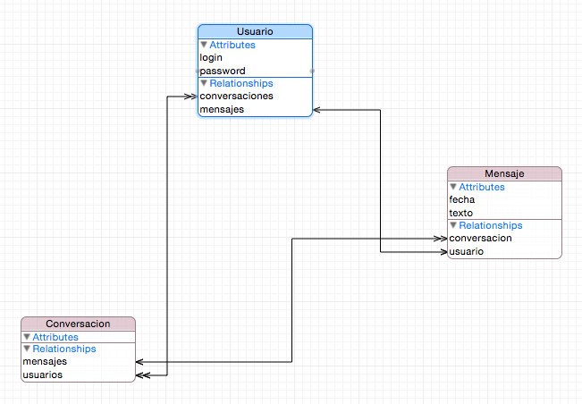

#Persistencia en dispositivos móviles
##iOS, sesión 6: Modelos de datos en Core Data


---

## Puntos a tratar

- **Creación y edición del modelo de datos**
- CRUD de objetos gestionados
- Validación
- Deshacer y rehacer


---

## Entidades

- Comparten ciertas características con las clases de la POO y otras con las tablas de una base de datos. 
- De POO: Pueden ser *abstractas* 
- De BD: Tienen relaciones con otras entidades (uno-a-uno, uno-a-muchos,…). Se especifica qué hacer cuando uno de los “lados” de la relación se elimina.


---



---

## Crear y editar el modelo de datos

- En el archivo `.xcdatamodeld`
- Xcode tiene un editor visual


---

# DEMO: crear un modelo de datos 

---

## Todas las entidades son `NSManagedObject`

- En la primera sesión, las notas estaban representadas en el código por `NSManagedObject`, y accedíamos a las propiedades con KVC

```objectivec
for (NSManagedObject *obj in resultados) {
    NSLog(@"%@", [obj valueForKey:@"texto"]);
} 
```

- Si hay varias entidades, tratarlas todas como `NSManagedObject` hace que el  código sea algo confuso

---

## Clases propias como entidades

- Es mejor definir nuestras propias clases Obj-C: `Usuario`, `Mensaje`, `Conversacion`,... y usarlas como entidades
- Xcode nos puede generar el esqueleto de la clase, junto con *getters* y *setters* para propiedades y relaciones.

---

# DEMO: generar subclases de `NSManagedObject`

---


## Puntos a tratar

- Creación y edición del modelo de datos
- **CRUD de objetos gestionados**
- Validación
- Deshacer y rehacer


---

## Creación 

- Ya vimos en la sesión anterior cómo crear y guardar un objeto gestionado. Ahora podemos hacer lo mismo usando nuestras propias clases, sin KVC

```objectivec
Usuario *u = [NSEntityDescription insertNewObjectForEntityForName:@"Usuario"
              inManagedObjectContext:self.managedObjectContext];
u.login = @"moviles";
u.password = @"123456";
NSError *error;
[self.managedObjectContext save:&error];
```

---

## Actualización

- Simplemente cambiar las propiedades o establecer relaciones y volver a llamar a `save`
- Recordemos que Xcode genera "accesores" para las relaciones "a uno" y "a muchos". También podríamos modificar directamente la propiedad asociada.

```objectivec
Conversacion *c1;
...
//Sup. c1 un objeto gestionado por Core Data
c1.comienzo = [NSDate date];
//El usuario empieza a participar en una conversación
//Usamos el método de acceso generado por Core Data
[usuario addConversacionesObject:c1];
...
```

- Cuando establecemos una relación Core Data **actualiza automáticamente la inversa**

---

## Borrado

- Eliminar un objeto del contexto: `deleteObject` sobre el contexto

```objectivec
[self.managedObjectContext deleteObject:usuario1]
```

- `deleteObject` no elimina el objeto del almacén persistente. Para eso tendremos que ejecutar `save`

- Al hacer `deleteObject` se ejecutan las reglas de borrado. Si se usara `Cascade` para `Conversacion` ->> `Mensaje`, al borrar una conversación se eliminarían todos sus mensajes. 

---

## Actualizar cambios pendientes


- Es posible que tras  `deleteObject` las actualizaciones no se propaguen de manera inmediata por el grafo de objetos. Para forzar la propagación:

```objectivec
[self.managedObjectContext processPendingChanges];
```

---

## Puntos a tratar

- Creación y edición del modelo de datos
- CRUD de objetos gestionados
- **Validación**
- Deshacer y rehacer

---

## Validación

- Se hace automáticamente al guardar el contexto de persistencia. Si algún objeto o relación no cumple con las reglas de validación, `save` generará un error indicándolo.

- En cualquier momento podemos comprobar manualmente si un determinado valor sería válido para una propiedad con `validateValue:forKey:error`.

---

## Validación propia

- Definir en la clase de la entidad métodos `validateXXX:error:`  donde `XXX` es la propiedad a validar

```objectivec
- (BOOL) validateFecha:(id *)valor error:(NSError **)error {
   NSDate *fecha = (NSDate *)(*valor);
   if ([[NSDate date] timeIntervalSinceDate:fecha]>=0) {
       return YES;
   }
   else {
       if (error!=NULL) {
          NSDictionary *dict = @{
               NSLocalizedDescriptionKey : 
                  @"La fecha no puede estar en el futuro"
          };
          (*error) = [[NSError alloc] initWithDomain:@"MiApp" 
                      code:1 userInfo:dict];
       }
       return NO;
   }
}
```

---

## Puntos a tratar

- Creación y edición del modelo de datos
- CRUD de objetos gestionados
- Validación
- **Deshacer y rehacer**

---

## Deshacer y rehacer

- Se pueden deshacer y rehacer las operaciones con objetos gestionados. De esto se encarga el *undo manager*, un objeto de la clase `NSUndoManager`. 
- Es tan simple como llamar a los métodos `undo` y `redo` del *undo manager*

---

## Activar el *undo manager*

- En iOS no está activado por defecto. Se puede aprovechar la inicialización del contexto

```objectivec
//"getter" de la plantilla generada al marcar "use Core Data"
- (NSManagedObjectContext *)managedObjectContext {
  ...
  [_managedObjectContext setPersistentStoreCoordinator:coordinator];
  NSUndoManager *undoManager = [[NSUndoManager alloc] init];
  [_managedObjectContext setUndoManager:undoManager];

  return _managedObjectContext;
}
```

---

## Grouping

- Por defecto se agrupan las operaciones efectuadas en la última ejecución de código por parte de la aplicación
- Podemos gestionar manualmente los grupos con `beginUndoGrouping` y `endUndoGrouping`

---


# ¿Alguna pregunta?