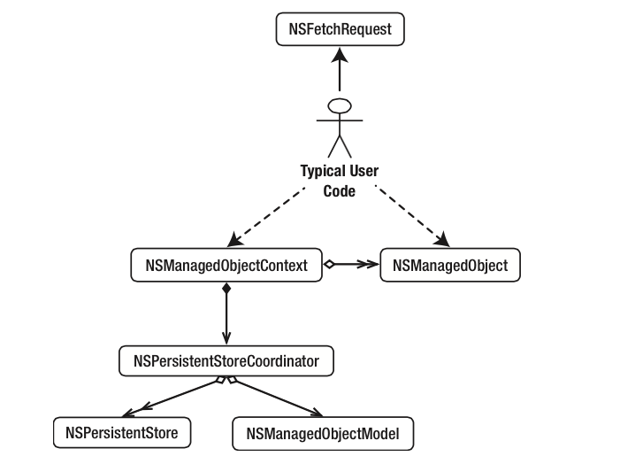

#Persistencia en dispositivos móviles
##iOS, sesión 4: ¡Hola Core Data!


---

##Puntos a tratar

- **Qué es Core Data**
- El *stack* de Core Data
- Crear y guardar objetos
- Recuperar objetos

---

## ¿Qué es Core Data?

El *framework* de persistencia de iOS. Almacena de forma **persistente los objetos de nuestra aplicación**. Es capaz de guardar un **grafo entero de objetos con sus relaciones** (uno a uno, uno a muchos, muchos a muchos) 

---

## Core Data es un ORM...

- *Object Relational Mapper*, permite almacenar de forma persistente objetos en una base de datos relacional (SQLite)
- Los que hayáis usado JPA(Java), Entity Framework(.NET), Doctrine (PHP), Active Record (Ruby), ... veréis ideas muy similares (y terminología, en algunos casos)

---

## ... bueno, no, en realidad no lo es


- Estrictamente hablando, **no es un ORM** ya que no soporta más que SQLite y además soporta otros almacenes de datos no relacionales (datos en memoria, archivos XML - solo OSX, almacenes propios,...)

---


Core Data is [...] capable of dealing with large volumes of data. The SQLite store can scale to terabyte sized databases with billions of rows/tables/columns. [...] 10,000 objects is considered to be a fairly small size for a data set.

For a very simple application it is certainly the case that Core Data adds some overhead [...], however, [...] supports undo and redo, validation, object graph maintenance, and provides the ability to save objects to a persistent store. If you implemented this functionality yourself, it is quite likely that the overhead would exceed that imposed by Core Data.

[Core Data Performance, Apple Developer Docs](https://developer.apple.com/library/ios/documentation/Cocoa/Conceptual/CoreData/Articles/cdPerformance.html)

---

## Puntos a tratar

- Qué es Core Data
- **El *stack* de Core Data**
- Crear y guardar objetos
- Recuperar objetos


---



---

## El *stack* de Core Data (1)

- `NSPersistentStore`: se ocupa de gestionar el almacenamiento persistente. Podemos crear nuestros propios almacenes de datos creando subclases de ella.

- `NSPersistentStoreCoordinator`: el núcleo de Core Data. Responsable de gestionar la persistencia (interactúa con el `NSPersistentStore`). 
  + Nuestro código no va a interactuar apenas con esta clase, salvo en su inicialización.

---

## El *stack* de Core Data (2)

- `NSManagedObjectModel`. similar a un modelo E-R en una BD relacional, define las “clases” del dominio, sus atributos y las relaciones entre clases. 
- En Xcode un modelo de datos se representa con un archivo `.xcdatamodeld` (hay un editor visual). El `NSManagedObjectModel` es la versión compilada y binaria de este archivo.


---

## El *stack* de Core Data (3)

- `NSManagedObjectContext`  es el “contexto de persistencia” (un grafo de objetos, relacionados entre sí, y cuyo ciclo de vida está gestionado - *managed* - por Core Data)

- `NSManagedObject`: los objetos gestionados
  - Podemos usar esta clase o crear descendientes. Así podemos usar nuestras propias clases como objetos persistentes.


---

## El *stack* de Core Data (y 4)

- `NSFetchRequest`. Al igual que en SQL podemos ejecutar consultas especificando las condiciones para los objetos a recuperar.


---

## Inicializar el *stack*

```objectivec
//El proyecto de Xcode se llama "TestCoreData"  
//inicializar el modelo de objetos
 NSURL *modelURL = [[NSBundle mainBundle] 
                     URLForResource:@"TestCoreData"
                     withExtension:@"momd"];
 NSManagedObjectModel *managedObjectModel = 
        [[NSManagedObjectModel alloc] initWithContentsOfURL:modelURL];
     
 //Inicializar el persistent store coordinator y asociarlo al modelo
 NSPersistentStoreCoordinator *persistentStoreCoordinator = 
        [[NSPersistentStoreCoordinator alloc] 
              initWithManagedObjectModel:managedObjectModel];
 NSURL *documentsURL = [[[NSFileManager defaultManager] 
     URLsForDirectory:NSDocumentDirectory inDomains:NSUserDomainMask] 
     lastObject];
 NSURL *storeURL = [documentsURL 
                     URLByAppendingPathComponent:@"TestCoreData.sqlite"];
 NSError *error = nil;
 [persistentStoreCoordinator addPersistentStoreWithType:NSSQLiteStoreType 
      configuration:nil URL:storeURL options:nil error:&error];
     
 //Inicializar el Managed Object Context y asociarlo al coordinator
 NSManagedObjectContext *managedObjectContext = 
                             [[NSManagedObjectContext alloc] init];
 [managedObjectContext setPersistentStoreCoordinator:persistentStoreCoordinator];
```

---

## Puntos a tratar

- Qué es Core Data
- El *stack* de Core Data
- **Crear y guardar objetos**
- Recuperar objetos


---

## Crear un objeto gestionado

- No podemos hacerlo con `alloc` e `init`, Core Data debe gestionar el ciclo de vida del objeto: desde que nace hasta que desaparece

```objectivec
//obtenemos el delegate, ya que es donde está el código de acceso a Core Data
AppDelegate *miDelegate = [[UIApplication sharedApplication] delegate];

//Para crear objetos persistentes necesitamos el contexto
NSManagedObjectContext *miContexto = [miDelegate managedObjectContext];

//Vamos a crear un objeto gestionado por Core Data
NSManagedObject *nuevaNota = [NSEntityDescription 
     insertNewObjectForEntityForName:@"Nota" 
     inManagedObjectContext:miContexto];
```

---

## Rellenar los campos del objeto gestionado


- `NSManagedObject` es una clase "genérica", podemos acceder a las propiedades de nuestra entidad usando KVC

```objectivec
[nuevaNota setValue:[NSDate date] forKey:@"fecha"];
[nuevaNota setValue:@"Core Data es genial!!...o no" forKey:@"texto"];
```

---

## Guardar los objetos en el almacenamiento persistente

- `save` sobre el contexto guarda todos los cambios en el grafo de objetos gestionados

```objectivec
NSError *error;
[miContexto save:&error];
```

---

# ¿Alguna pregunta?