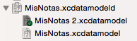
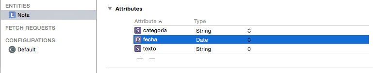
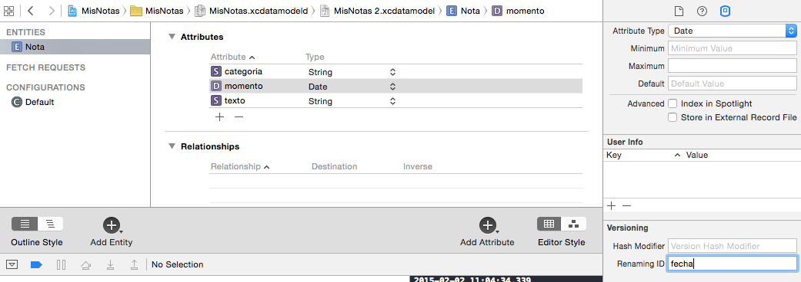
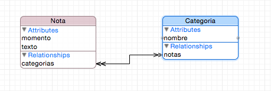
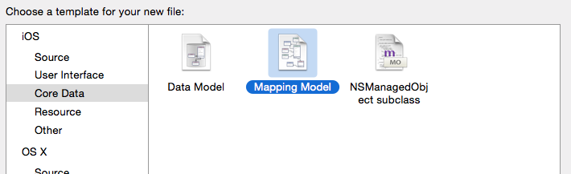
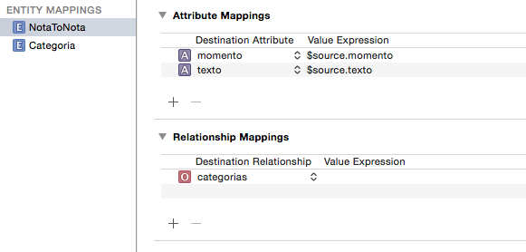
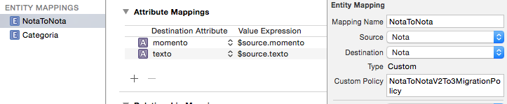

#Persistencia en dispositivos móviles
##iOS, sesión 8: Migraciones de datos en Core Data


---

## Puntos a tratar

- **Migraciones de datos y versiones del modelo**
- Migraciones "ligeras"
- Migraciones "pesadas"


---

## Modificaciones del modelo de datos

- Es normal que durante el desarrollo se vaya **modificando iterativamente el modelo de datos**
- Cuando hay cambios **Core Data modifica automáticamente la estructura de la base de datos**. Pero ¿qué pasa con los datos ya creados?

---

## Migración de datos

- Procedimiento que especifica **cómo transformar los datos de la antigua versión del modelo a la nueva versión**
- Tipos:
  + **"Ligera"**: iOS realiza la transformación de modo automático/semiautomático
  + **"Pesada"**: tenemos que hacerla nosotros, típicamente por código


---

## Gestionar versiones del modelo

- Podemos tener **varias versiones del mismo `.xcdatamodeld`**. Ir a `Editor > Add Model Version...`
- Físicamente serán distintos archivos, pero Xcode nos los muestra como un *bundle*



- En cada momento indicamos cuál es la **versión actual**

---


## Puntos a tratar

- Migraciones de datos
- Versiones del modelo
- **Migraciones "ligeras"**
- Migraciones "pesadas"


---

## Migraciones ligeras


- Podemos usarlas si los cambios son
  - Añadir o eliminar un atributo o relación
  - Convertir en opcional un atributo requerido
  - Convertir en requerido un atributo opcional, siempre que se dé un valor por defecto
  - Añadir o eliminar una entidad
  - Renombrar un atributo o relación
  - Renombrar una entidad

---

## Ventajas de las migraciones ligeras

- Son **automáticas**, no requieren escribir código

- Son **rápidas** y requieren pocos recursos computacionales. En el caso de SQLite se ejecutan con comandos del propio SQLite (`ALTER TABLE`,...)

---

## Ejemplo

- En la aplicación de notas, añadir un campo opcional `categoria`




---

## "Activar" la migración

- En la inicialización del "persistent store coordinator"

```objectivec
 NSDictionary *opts = @{
      NSMigratePersistentStoresAutomaticallyOption: @YES,
      NSInferMappingModelAutomaticallyOption: @YES
};
[persistentStoreCoordinator addPersistentStoreWithType:NSSQLiteStoreType
     configuration:nil URL:storeURL 
     options:opts error:&error]
```

---


## "Activar" la migración (y 2)

- Cambiar la versión del modelo en Xcode: en el editor del modelo, en el panel de la derecha, seleccionar la versión en el desplegable `Model Version`

- Al arrancar la aplicación, Core Data detecta que
  + El modelo actual no se corresponde con el usado para crear el almacén persistente
  + Se ha especificado que realice una migración automática y que intente deducir él mismo la transformación

---

## Migraciones ligeras con cambios de nombre

- Cambiamos el campo "fecha" por "momento". Correspondencia con el nombre antiguo en `renaming ID`



- En el código debemos renombrar también manualmente


---

## Puntos a tratar

- Migraciones de datos
- Versiones del modelo
- Migraciones "ligeras"
- **Migraciones "pesadas"**


---

## Migraciones "pesadas"

- Habrá cambios para los que Core Data **no puede inferir automáticamente la transformación**

- Ejemplo: transformar el atributo "categoria" en una entidad



---

## Proceso de una migración "pesada"


- Hay **dos "*stacks*" de Core Data en funcionamiento** (con dos contextos de persistencia): el del modelo antiguo y el del nuevo
- Hay que ir cargando entidad por entidad en memoria e ir convirtiéndolas al "nuevo formato", no se puede hacer en la propia BD

---

## Crear el "mapping model"

- Hay que **crear manualmente** un "mapping model"




- El asistente nos pregunta **de qué versión a qué version** del modelo de datos estamos transformando

---

## El "mapping model"


- Consiste en un conjunto de transformaciones de los objetos "antiguos" a los "nuevos". Se usa el nombre `EntidadAntiguaToEntidadNueva`
- Xcode intenta deducir la transformación. Lo conseguirá para las partes que no cambien demasiado



---

## Migration Policy

- La encargada de efectuar la transformación es la clase `NSEntityMigrationPolicy`

- Para especificar manualmente la política de migración creamos una subclase de `NSEntityMigrationPolicy` y especificamos que queremos usarla para determinada parte de la transformación




---

## Nuestra propia "migration policy"

- Generalmente se sobreescribe el método `createDestinationInstancesForSourceInstance:entityMapping:manager:error:`

```objectivec
- (BOOL) createDestinationInstancesForSourceInstance:(NSManagedObject *)sInstance entityMapping:(NSEntityMapping *)mapping manager:(NSMigrationManager *)manager error:(NSError *__autoreleasing *)error {
  
  //Crea una nueva nota en el "nuevo modelo" con las mismas propiedades que la nota actual
  NSManagedObject *notaDestino = [NSEntityDescription insertNewObjectForEntityForName:@"Nota" inManagedObjectContext:manager.destinationContext];
  [notaDestino setValue:[sInstance valueForKey:@"texto"] forKey:@"texto"];
  [notaDestino setValue:[sInstance valueForKey:@"momento"] forKey:@"momento"];
  
  //Miramos si ya hemos creado una entidad Categoria para la categoria de la nota
  NSString *nombreCategoria = [sInstance valueForKey:@"categoria"];
  NSManagedObject *categoria = [categorias objectForKey:nombreCategoria];
  
  //Si no la hemos encontrado, la creamos
  if (!categoria) {
      categoria = [NSEntityDescription insertNewObjectForEntityForName:@"Categoria" inManagedObjectContext:manager.destinationContext];
      [categoria setValue:nombreCategoria forKey:@"nombre"];
      [categorias setObject:categoria forKey:nombreCategoria];
  }
  
  //Asociamos la nota con su por ahora única categoría
  //Como es una relación 1->N es un NSSet que por ahora tendrá un único elemento
  NSSet *categoriasDeNota = [[NSSet alloc]initWithObjects:categoria, nil];
  [notaDestino setValue:categoriasDeNota forKey:@"categorias"];
  
  
  //Al final siempre hay que llamar a este método para establecer correspondencia
  //entre entidad en el modelo actual y entidad en el nuevo
  [manager associateSourceInstance:sInstance withDestinationInstance:notaDestino forEntityMapping:mapping];
  
  
  return YES;
  
}
```

---


## Configurar la migración

- Al configurar el "persistent store coordinator"

```objectivec
NSDictionary *opts = @{
  NSMigratePersistentStoresAutomaticallyOption: @YES,
  NSInferMappingModelAutomaticallyOption: @NO
};
```
- Lo único que falta es establecer el nuevo modelo como la versión actual
- Al arrancar la aplicación Core Data detectará que 
  + El modelo de datos actual no es el mismo que el usado para crear la BD
  + No se debe inferir automáticamente la transformación. Buscará un "mapping model" compatible con la versión actual y la anterior, y lo aplicará

---

#iOS10 vs. versiones anteriores

- En iOS9 no existe `NSPersistentContainer`, que gestiona el *stack* de Core Data. Las clases que se usan en su lugar **no tienen las migraciones automáticas activadas**. 
- Por defecto, si modificamos el modelo de datos y ejecutamos, aparecerá un error

```bash
The model used to open the store is incompatible with the one used to create the store
```

Para activar las migraciones automáticas:

```swift
//ESTO SE AÑADE
let opciones = [
      NSInferMappingModelAutomaticallyOption : false,
      NSMigratePersistentStoresAutomaticallyOption : true
]
//ESTO YA ESTABA, pero antes con el options a nil
do {
    try coordinator.addPersistentStore(ofType: NSSQLiteStoreType, configurationName: nil, at: url, options: opciones)
} catch {
```


---


# ¿Alguna pregunta?