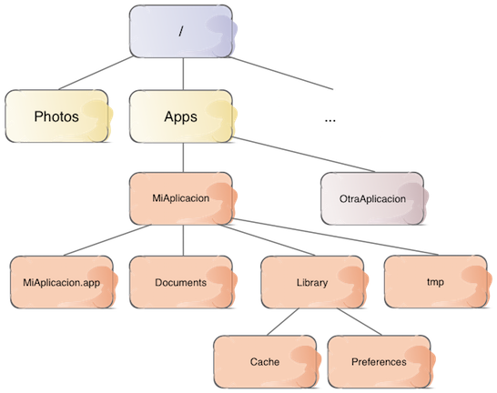

#Persistencia en dispositivos móviles
##iOS, sesión 1: Persistencia básica


---

##Persistencia de datos en iOS

- **Persistencia básica** (poca cantidad de datos, no ofrece mecanismos de búsqueda y organización sofisticados)
  + Property Lists
  + Preferencias de usuario
  + Serialización de objetos

---

##Persistencia de datos en iOS (2)

- **"Database-like"** (mayor cantidad de datos, mecanismos de búsqueda)
  + SQLite
  + Core Data
  + APIs de terceros (en "la nube"), APIs propios (iCloud)

---

##Persistencia de datos en iOS (y 3)

- **"Objetos persistentes"** del sistema, accesibles desde las aplicaciones
  + Calendario
  + Contactos


---

##Puntos a tratar hoy

- El sistema de archivos en iOS
- *Property Lists*
- Preferencias del usuario


---

##Puntos a tratar hoy

- **El sistema de archivos en iOS**
- *Property Lists*
- Preferencias del usuario

---


## *Sandboxing*

Cada aplicación está contenida en un **sandbox** de modo que únicamente ella puede acceder a sus propios datos. Esto incluye los archivos y directorios de la aplicación

---

## El sistema de archivos de iOS




---

## Paths vs URLS

En el API podemos usar *paths* o *URLs* para localizar un archivo o directorio

- Normalmente en los métodos que usan *path* su nombre acaba en `Path` y el método equivalente con URLs se llama igual pero acabado en `URL` 
- La documentación recomienda URLs por uniformidad 


```objectivec
//¿Dónde está el "bundle" de la aplicación?
NSString *bundleDir = [[NSBundle mainBundle] bundlePath];
NSURL *bundleURL = [[NSBundle mainBundle] bundleURL];
```

---


## Localizar los directorios de la aplicación

```objectivec
NSFileManager *fileManager = [[NSFileManager alloc] init];
NSArray *urls = [fileManager 
   URLsForDirectory:NSDocumentDirectory
   inDomains:NSUserDomainMask];
//Nótese que se obtiene un array de URLs, no una sola
if ([urls count] > 0){
   //Como en una app iOS solo hay un directorio 'Documents'
   //será la primera posición del array
   NSURL *docsFolder = urls[0];
   NSLog(@"%@", docsFolder);
} else {
   NSLog(@"Error al buscar el directorio 'Documents'");
}
```

---

## Rutas típicas

- En un **dispositivo real** nos aparecerá una URL del estilo `file:///var/mobile/Containers/Data/Application/
id_de_la_aplicacion/Documents`.

- En el **simulador** la URL será similar (salvo la primera parte de la trayectoria), algo como `file:///Users/nombre_usuario/Library/Developer/
CoreSimulator/Devices/
id_del_dispositivo/data/Containers/Data/Application
/id_de_la_aplicacion/Documents/`

---


## El directorio temporal

```objectivec
NSString *tmpDir = NSTemporaryDirectory();
NSLog(@"Dir. archivos temporales: %@", tmpDir);
```

- Nótese que `NSTemporaryDirectory` no es un método, sino una función, al estilo de `NSLog`

---

## Listar contenido de directorio

```objectivec
NSString *miBundleURL = [[NSBundle mainBundle] bundleURL];
NSError *error = nil;
NSArray *contenidos = [fileManager
                       contentsOfDirectoryAtURL: miBundleURL
                       includingPropertiesForKeys: @[
                          NSURLCreationDateKey,
                          NSURLIsDirectoryKey
                        ];
                       options: 0
                       error:&error];
```

- hay un `contentsOfDirectoryAtPath:...` muy similar si preferimos usar *paths* en lugar de URLs

---

##Puntos a tratar hoy

- El sistema de archivos en iOS
- ***Property Lists***
- Preferencias del usuario

---

## Escribir datos en un archivo

- **Determinadas clases de Cocoa son fácilmente serializables** en un archivo. 
- Estas clases son `NSString`, `NSData`, `NSNumber`, `NSDate`, y las colecciones `NSArray` y `NSDictionary` (incluyendo las versiones mutables)
- Cuidado, las colecciones deben ser a su vez de objetos "directamente serializables"


```objectivec
NSString *mensaje = @"hola";
[mensaje writeToURL:fich_URL atomically:YES];
```

---

## Property Lists

- Son colecciones de propiedades de los tipos anteriormente descritos. Su uso es muy amplio en iOS/OSX
- En fichero se les suele dar la extensión `.plist`. Se pueden almacenar en formato XML o binario

```xml
<?xml version="1.0" encoding="UTF-8"?>
<!DOCTYPE plist PUBLIC "-//Apple//DTD PLIST 1.0//EN" "http://www.apple.com/DTDs/PropertyList-1.0.dtd">
<plist version="1.0">
<dict>
 <key>otro_valor</key>
 <array>
   <integer>1</integer>
   <integer>2</integer>
 </array>
 <key>un_valor</key>
 <string>hola</string>
</dict>
</plist>
```

---

## Guardar el .plist: 1. Crear la estructura de datos

```objectivec
NSArray *miArray = @[@1,@2,@3];
NSDictionary *dict =  @{
     @"un_valor" : @"hola",
     @"otro_valor" : miArray
};
```

- Restricción: los diccionarios solo pueden tener claves del tipo `NSString`

---

## Guardar el .plist: 2. Serializar los datos

- Guardamos la colección "raíz"

```objectivec
//Buscamos la URL de la carpeta de Documents
NSArray *urls = [fileManager URLsForDirectory:NSDocumentDirectory
                             inDomains:NSUserDomainMask];
//Suponemos de modo temerario que lo anterior no ha fallado
NSURL *docs_url = urls[0];
NSURL *fich = [docs_url URLByAppendingPathComponent:@"mi_plist.plist"];
if ([dict writeToURL:fich atomically:YES])
    NSLog(@"\nSe ha escrito el archivo correctamente");
else
    NSLog(@"\nError al guardar %@", fichPlist.absoluteString);
```

---

## Leer una *property list* desde un fichero

```objectivec
NSDictionary *dict = [[NSDictionary alloc] initWithContentsOfFile:path_plist];
```

- muy similar con URLs: `initWithContentsOfURL`

---

## Incluir un .plist en nuestro proyecto Xcode

- Xcode incluye un **editor visual de archivos .plist**, capaz de editar XML/binario
- `File>New` para añadir un .plist al proyecto
- Acceder al archivo es sencillo

```objectivec
//obtiene el path del fichero "prueba.plist" del bundle
NSString *path_plist = [[NSBundle mainBundle]
                        pathForResource:@"prueba"
                        ofType:@"plist"];
```

- **Cuidado**: el *bundle* es solo de lectura

---

##Puntos a tratar hoy

- El sistema de archivos en iOS
- *Property Lists*
- **Preferencias del usuario**

---

## Preferencias de usuario

- Elementos tales como colores, tipos de fuentes, unidades de medida, nombres de usuarios y contraseñas de servicios de terceros, etc.
- iOS solo nos da el API para leer/almacenar las preferencias, pero no el interfaz de usuario para mostrarlas/modificarlas, que es nuestra responsabilidad, salvo en el caso del *settings bundle*

---

## Qué se puede guardar en las preferencias de usuario

- Las preferencias de usuario no son más que una *property list* en la que el objeto “raíz” debe ser un `NSDictionary`.

- Por defecto iOS usa formato binario, también podemos editarlo con el editor visual de Xcode, o convertirlo con una herramienta llamada `plutil`.

---

## Acceder al conjunto de preferencias

- *Singleton* de la clase `NSUserDefaults`
- Evidentemente cada aplicación solo puede acceder a sus propias preferencias. Ni siquiera el sistema puede acceder a ellas salvo que las coloquemos en un *settings bundle*

```objectivec
NSUserDefaults *prefs = [NSUserDefaults standardUserDefaults];
```

---

## Acceder a cada preferencia

- Son pares "clave-valor"
- Hay una familia de métodos `xxxForKey` al estilo del `objectForKey` de los diccionarios

```objectivec
NSString *nick = [prefs stringForKey:@"nick"];
NSInteger creditos = [prefs integerForKey:@"creditos"];
```

---


## Preferencias no fijadas

- Si no se hubiera guardado una preferencia con la clave `creditos` el valor obtenido sería 0
- ¿Cómo diferenciar si la preferencia se ha fijado a 0 o bien no se ha fijado?. Solución: registrar *valores por defecto*

---

## Registro de valores por defecto

```objectivec
NSUserDefaults *prefs = [NSUserDefaults standardUserDefaults];
[prefs registerDefaults:@{
          @"nick": @"(anonimo)",
          @"creditos" : @100
 }];
```

- Los valores registrados por defecto **no son permanentes**, hay que llamar a `registerDefaults` cada vez que se ejecute la aplicación

---

## Dominios de preferencias

- Cuando se registran los valores por defecto no "machacan" a los fijados por el usuario porque se sigue un esquema de "dominios"
- Solo se usa el valor por defecto si no se ha encontrado en el "dominio" de los fijados por el usuario

---

## Modificar las preferencias

```objectivec
NSUserDefaults *prefs = [NSUserDefaults standardUserDefaults];
[prefs setObject:@"Pepito" forKey:@"nick"];
[prefs setInteger:50 forKey:@"creditos"];
```

---

## Ubicar las preferencias en la app de "configuración"

- **Settings bundle**: un fichero .plist con un formato especial para configurar un interfaz de usuario para editar/ver preferencias de la aplicación
- Las preferencias del *settings bundle* aparecen en la app de configuración
- Apple recomienda colocar aquí las preferencias que cambien raramente

---


---

## El .plist del "settings bundle"


