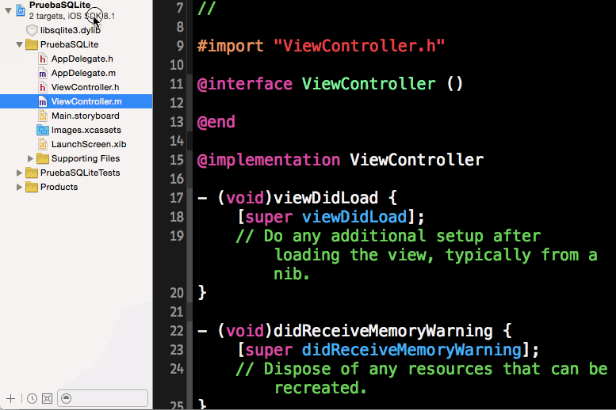

#Persistencia en dispositivos móviles
##iOS, sesión 3: Bases de datos con SQLite


---

##Puntos a tratar

- SQLite en iOS
- Acceso básico a la BD
- Consultas de selección
- Consultas de actualización
- *Frameworks* de terceros

---

##SQLite en iOS

- Como ya sabéis es una BD embebida (no necesita servidor), ligera, portable,....
- Problema en iOS: **no hay un API Objective-C oficial**, ya que Apple recomienda usar "Core Data" en lugar de SQLite directamente.  

---

## El API C de SQLite

- Lo más habitual es usar el [**API C de SQLite**](http://www.sqlite.org/cintro.html)
- Tendremos que convertir entre los tipos de datos de Objective-C y C

```objectivec
//De NSString a char*
NSString *mensaje = @"Hola C";
char *mensaje_c = [mensaje UTF8String])

//De char* a NSString: 
NSString *mensajeConv = [[NSString alloc] initWithUTF8String:mensaje_c];
```

---

## Configurar el proyecto para SQLite

- Hay que añadir **manualmente** la librería




---

## Crear la Base de Datos y añadirla al proyecto

- Normalmente se copia al *bundle* de la aplicación


---

##Puntos a tratar

- SQLite en iOS
- **Acceso básico a la BD**
- Consultas de selección
- Consultas de actualización
- *Frameworks* de terceros


---

## Acceso básico a la base de datos

- La BD se representa con un `struct` del API (recordad que no es OO)

```c
sqlite3 *mi_bd;
```

- Para abrir la BD se usa la función `sqlite3_open`

```c
sqlite3_open(path_db, &mi_bd);
```

---

## Ejemplo: poner una fina capa OO sobre el API C

```objectivec
#import <Foundation/Foundation.h>
#import <sqlite3.h>

@interface DBManager : NSObject
{
  sqlite3 *db;
}

- (id) initWithDB:(NSString *)nombre;
@end
```

---

## Inicializar/liberar el `DBManager`

```objectivec
- (id)initWithDB:(NSString *)nombre {
    self = [super init];
    if (self) {
        NSString *path = [[NSBundle mainBundle]
                          pathForResource:nombre
                          ofType:@"db"];   
        if (sqlite3_open([path UTF8String], &db) == SQLITE_OK) 
            NSLog(@"BD abierta"); 
        else 
            NSLog(@"Error al abrir BD: %s", sqlite3_errmsg(db));
    }
    return self;
}
```

```objectivec
- (void) dealloc {
    sqlite3_close(db);
}
```

---

## "Conseguir permiso de escritura" en la BD


```objectivec
- (NSURL *) copiarDB:(NSString *)nombre {
 BOOL existe, ok;
 NSFileManager *fileManager = [NSFileManager defaultManager];
 //Obtenemos la URL del directorio 'Documents'
 NSArray *urls = [fileManager URLsForDirectory:NSDocumentDirectory
                             inDomains:NSUserDomainMask];
 //La copia de la BD estará en este directorio, 
 //con el nombre especificado y extensión '.db'
 NSString *nombreFichDB = [NSString stringWithFormat:@"%@.db", nombre];
 NSURL *copiaURL = [urls[0] URLByAppendingPathComponent:nombreFichDB];
 //¿Existe ya esta copia?
 existe = [fileManager fileExistsAtPath:[copiaURL path]];
 //Si existe, no hay que hacer nada, devolvemos la URL
 if (existe)
     return copiaURL;
 else { //copiar BD de bundle -> documents
     //URL de la BD en el bundle
     NSURL *dbURL = [[NSBundle mainBundle]
                       URLForResource: nombre withExtension:@"db"];
     //Copiar el archivo de la BD
     NSError *error;
     ok = [fileManager copyItemAtURL:dbURL toURL:copiaURL error:&error];
     if (!ok) {
         NSLog(@"No se ha podido crear una copia de la BD:'%@'.", 
              [error localizedDescription]);
         return nil;
     }
     else
         return copiaURL;
 }
}
```

---

## El inicializador modificado

```objectivec
- (id)initWithDB:(NSString *)nombre {
  self = [super init];
  if (self) {
      NSURL *urlDB = [self copiarDB:nombre];
      if (sqlite3_open([[urlDB path] UTF8String], &db) == SQLITE_OK) {
          NSLog(@"BD abierta"); }
      else {
          NSLog(@"Error al abrir BD: '%s'.", sqlite3_errmsg(db));
      }
  }
  return self;
}
```

---

##Puntos a tratar

- SQLite en iOS
- Acceso básico a la BD
- **Consultas de selección**
- Consultas de actualización
- *Frameworks* de terceros

---

## Pasos para ejecutar una consulta de selección


1. Compilar la *query* (SQL en “modo texto” -> formato “ejecutable”)
2. Mientras queden registros avanzar uno por los resultados
  - Obtener los campos que nos interesen del registro actual, sabiendo el número de columna que ocupan
  - Normalmente “empaquetaremos” los valores del registro actual en un objeto de Objective-C, e iremos construyendo una lista de resultados (un `NSMutableArray`).
3. Liberar la memoria ocupada por la *query* compilada

---

## Consulta de selección: ejemplo de código

```objectivec
NSString *querySQL = @"SELECT * FROM alumnos";
sqlite3_stmt *statement;
NSMutableArray *lista = [[NSMutableArray alloc] init];
    
int result = sqlite3_prepare_v2(db, [querySQL UTF8String], -1,
                                &statement, NULL);
if (result==SQLITE_OK) {
   while (sqlite3_step(statement) == SQLITE_ROW) {
       char *dni = (char *) sqlite3_column_text(statement, 0);
       char *nombre = (char *) sqlite3_column_text(statement, 1);
       Alumno *alumno = [[Alumno alloc] init];
       alumno.dni = [[NSString alloc] initWithUTF8String:dni];
       [lista addObject:alumno];
   }
}
sqlite3_finalize(statement);
```

---

## Fechas en SQLite

- SQLite no tiene tipo fecha. Podemos representarla con una cadenas o un entero (“UNIX timestamp”). Ejemplo de esto último:

```objectivec
int unix_time = (int) sqlite3_column_int(statement, 3);
Alumno *alumno = [[Alumno alloc] init];
alumno.fechaNacimiento = [[NSDate alloc] 
                             initWithTimeIntervalSince1970:unix_time];
```

---

## Consultas con parámetros

- Vincular parámetros por posición: `sqlite3_bind_XXX` donde XXX es el tipo de datos.

```objectivec
NSString *querySQL = @"SELECT * FROM alumnos WHERE fecha_nacimiento<?";
sqlite3_stmt *statement;
    
int result = sqlite3_prepare_v2(db, [querySQL UTF8String], -1,
                                &statement, NULL);
NSCalendar *cal = [NSCalendar currentCalendar];
//Calculamos fecha de hoy ([NSDate date]) y le restamos 18 años
NSDate *fecha_ref = [cal dateByAddingUnit:NSCalendarUnitYear 
                         value:-18 toDate:[NSDate date] options:0];
sqlite3_bind_int(statement, 1, [fecha_ref timeIntervalSince1970]);
```

---

##Puntos a tratar

- SQLite en iOS
- Acceso básico a la BD
- Consultas de selección
- **Consultas de actualización**
- *Frameworks* de terceros

---


## Consultas de actualización


```objectivec
Alumno *a;
...
NSString *querySQL = @"INSERT INTO alumnos (dni, nombre, apellidos, 
                      fecha_nacimiento) VALUES (?,?,?,?)";
sqlite3_stmt *statement;
sqlite3_prepare_v2(db, [querySQL UTF8String], -1, &statement, NULL);
sqlite3_bind_text(statement, 1, [a.dni UTF8String], -1, SQLITE_STATIC);
sqlite3_bind_text(statement, 2, [a.nombre UTF8String], -1, SQLITE_STATIC);
sqlite3_bind_text(statement, 3, [a.apellidos UTF8String], -1, SQLITE_STATIC);
sqlite3_bind_int(statement, 4, [a.fechaNacimiento timeIntervalSince1970]);
int result = sqlite3_step(statement);
if (result==SQLITE_DONE)
   NSLog(@"Registro almacenado OK");
```

```objectivec
sqlite3 *db;
NSLog(@"Filas afectadas: %d", sqlite3_changes(db));

```

---

##Puntos a tratar

- SQLite en iOS
- Acceso básico a la BD
- Consultas de selección
- Consultas de actualización
- ***Frameworks* de terceros**

---

## Frameworks de terceros para SQLite

- Han surgido unos cuantos APIs de terceros para "llenar el vacío" de un API SQLite en Objective-C, que Apple no está dispuesto a desarrollar.
- De ellos el más conocido es [FMDB](https://github.com/ccgus/fmdb)

---

## Abrir BD + ejecutar consulta de selección

```objectivec
NSString *dbPath = [[NSBundle mainBundle] pathForResource:@"cursos" 
                    ofType:@"db"];
FMDatabase *db = [FMDatabase databaseWithPath:dbPath];
if (![db open]) {
    NSLog(@"Error al abrir BD: %@", [db lastErrorMessage]);
}
else {
    NSLog(@"BD abierta");
    FMResultSet *rs = [db executeQuery:@"SELECT * FROM alumnos"];
    while ([rs next]) {
        NSLog(@"%@", [rs stringForColumn:@"nombre"]);
    }
    [db close];
}
```

- con consultas de actualización se usa `executeUpdate`


---

## Consultas con parámetros

```objectivec
FMResultSet *rs = [db executeQuery:@"SELECT * FROM alumnos
                   where fecha_nacimiento<?", fecha_ref];
```

- Los parámetros deben ser objetos, no tipos primitivos

```objectivec
FMResultSet *rs = [db executeQuery:@"SELECT * FROM alumnos
                    where altura>?", @1.70];
```

---

## Parámetros por nombre

- Se crea un diccionario cuyas claves son los nombres de los parámetros
- Aunque en el API C también existen, allí su uso es mucho más tedioso

```objectivec
NSString *query = @"INSERT INTO alumnos (dni, nombre) VALUES (:dni, :nombre)";
NSDictionary *args = @{
    @"dni" : @"12222333K",
    @"nombre" : @"Pepito",
};
[db executeUpdate:query withParameterDictionary:args];
```

---

# ¿Alguna pregunta?